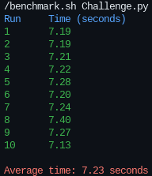
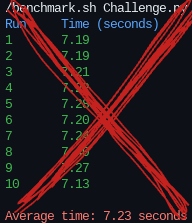
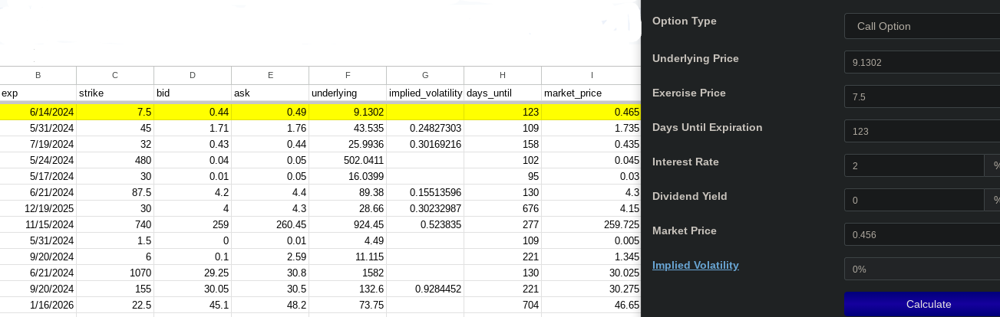

# [DL Software Finance Challenge](https://github.com/DL-Software/jobs)

1. Download the [`options.csv`](Python/options.csv) file. Each row is an obfuscated option contract and it's corresponding bid, ask, and underlying security price.

2. Use the european Black-Scholes Model to calculate the implied volatility for every option in the csv.

3. Add a new column to the CSV with the IV. Try to optimize this calculation for speed as much as possible. We will benchmark your code. Include the final runtime in your submission. Extra points for adding Greeks.

## Results  

Results computed with CPU vs GPU:

| CPU                                      | GPU                                      |
|------------------------------------------|------------------------------------------|
|  |  |
| **[Github Codespace](https://docs.github.com/en/codespaces/overview)** | **Personal Computer**  |
| > **CPU**: 2 cores           | > ~~**CPU**: 10 cores~~      |
| > **RAM**: 8 GB              | > ~~**RAM**: 8 GB~~          |
| > **GPU**: N/A               | > ~~**GPU**: Nvidia RTX 3060~~  |
<!-- | > **Storage**: 32 GB         | > - **Storage**: 32 GB          | -->

The benchmark program can be seen at [`benchmark.sh`](./benchmark.sh). The core function of the program is to compute the averages over 10 runs.

## Optimization Overview

The task is to compute the implied volatility for options (both calls and puts) based on their market prices. For the challenge I used different optimizations to quickly compute and complete the task.

1. **Newton's Method for Root-Finding**:
   The implied volatility is calculated iteratively by applying Newton's method to minimize the difference between the theoretical and market prices of the option.

2. **Using [PyTorch](https://pytorch.org) for calculations:**
   Using pytorch to calculate equations like Black-Scholes takes advantage of pytorch's tensor operations, automatic differentiation features, batch processing and GPU Acceleration.

   > A further implementation of PyTorch could be used to stream live data and calculate it on they fly with [`torch.cuda.stream`](https://pytorch.org/docs/stable/generated/torch.cuda.stream.html) if given live option contracts.

3. **Vectorization**:
   The program also use vectorization for the options.csv data to quickly pipe it into the IV calculator and prevent I/O bottlenecks.

## Invalid Options

When looking at the data provided by [`options.csv`](options.csv) some option contracts apear invalid.

I believe the reason for this is because the options data was randomly built or built to be inaccurate, not because my program can't handle it. Other IV calculators return `0`. See photo below.👇

## Resources/Links

**[Implied Volatility](https://www.financialwisdomforum.org/gummy-stuff/implied-volatility.htm)**

- **[Implied Volatility example spreadsheet](https://docs.google.com/spreadsheets/d/1Oe3CEuT-G7XpdyxwDmEcML27LqBYuwQkeI7vhLz264k/edit?usp=sharing)**

**[out.csv spreadsheet](https://docs.google.com/spreadsheets/d/1QQliF0m2APxm7_drVYCYtX8tX8Nh9khQcTDdtQDO1fM/edit?usp=sharing)**

**[Newton's method](https://en.wikipedia.org/wiki/Newton%27s_method)**

**[MibianLib](https://github.com/yassinemaaroufi/MibianLib/tree/master)**

**[PyTorch Optimization](https://pytorch.org/tutorials/recipes/recipes/tuning_guide)**
